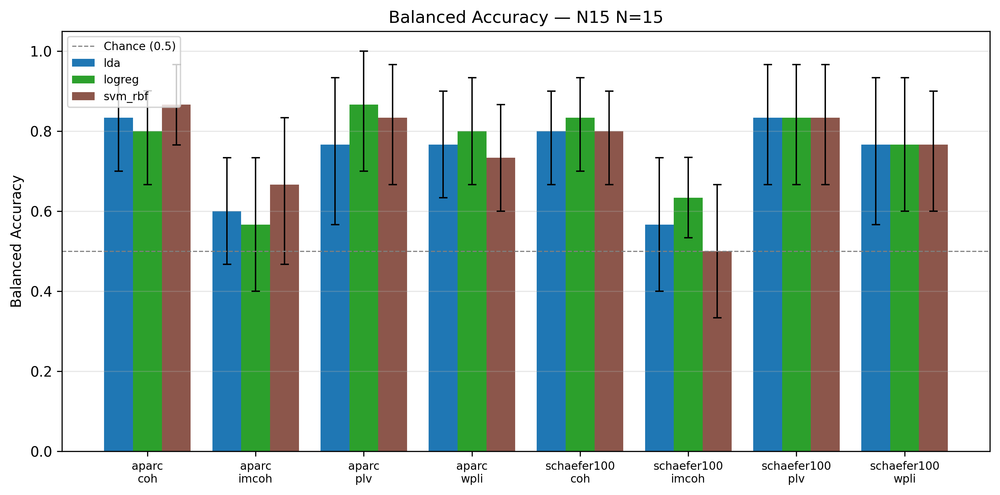
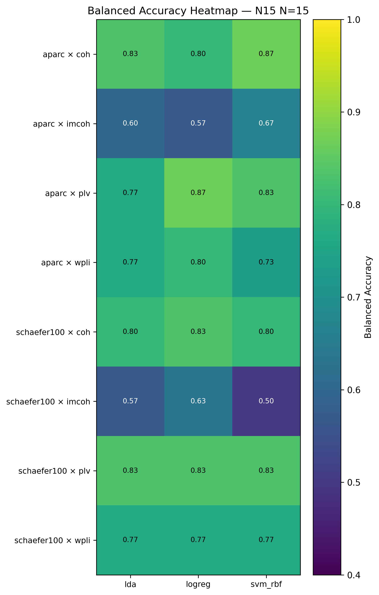
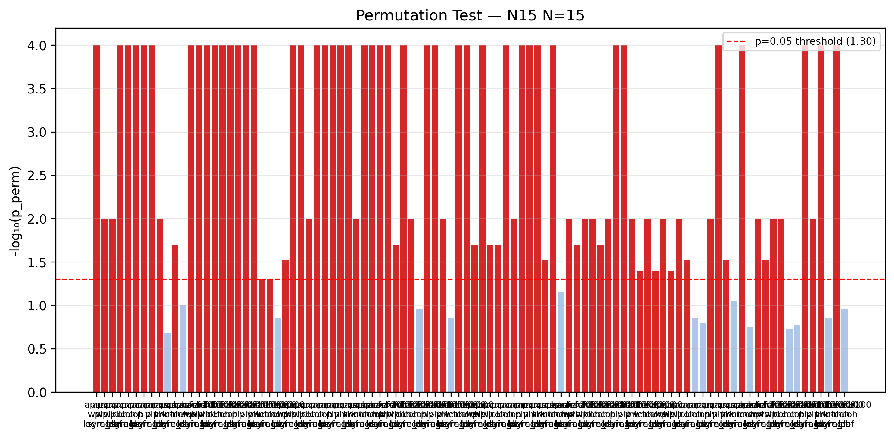
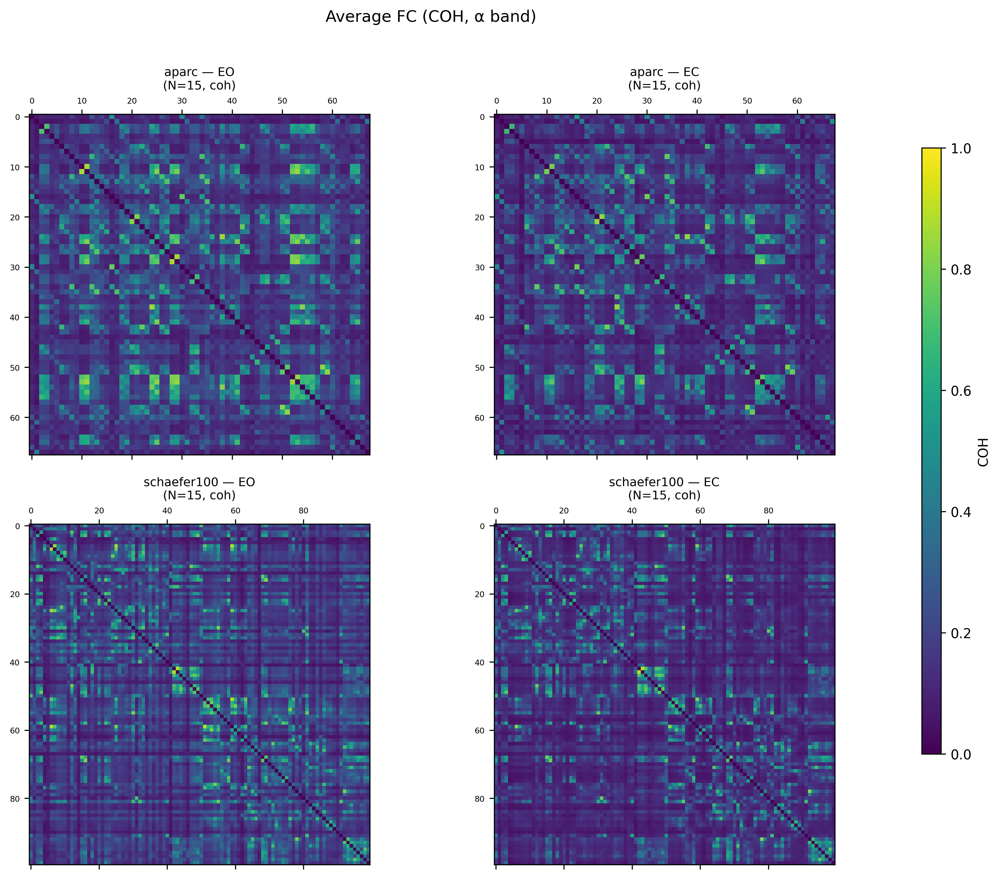
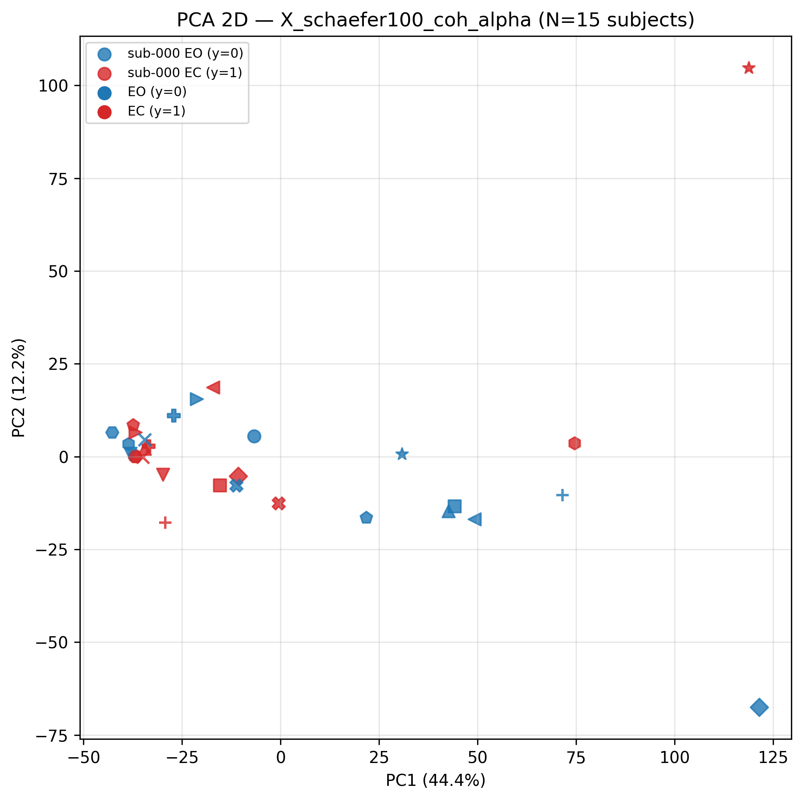
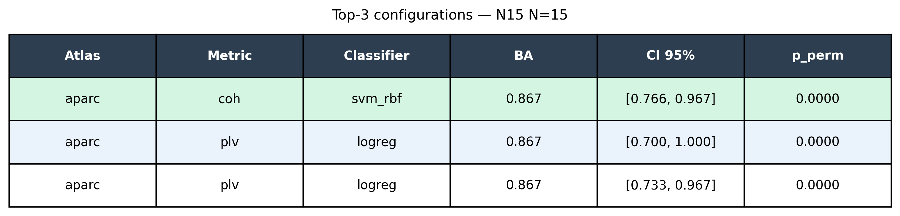

# N=15 Figures — Results Visualizations

**Source**: `data/results/ds005385/comparison_matrix_N15.json` (N=15 — FINAL)
**Generated**: 2026-05-05T21:17+02:00
**Script**: `scripts/generate_figures.py`
**Sprint**: S-FIG-N15

**Winner**: aparc × coh × svm_rbf — BA = 0.833, p_perm = 0.000, CI [0.700, 0.933]

---

## Figure 1 — Balanced Accuracy per Configuration



**Caption**: Balanced accuracy for each (atlas, metric, classifier) combination,
LOSO GroupKFold-15 (N=15 subjects, leave-one-subject-out). X-axis groups: atlas × metric.
Error bars: 95% bootstrap CI. Dashed line at chance (0.5). Winner: aparc × coh × svm_rbf
(BA = 0.833).

---

## Figure 2 — Balanced Accuracy Heatmap



**Caption**: Heatmap of balanced accuracy across all (atlas × metric) × classifier
combinations. Color scale: viridis [0.4, 1.0]. Cell values annotated. Coherence (coh)
consistently outperforms wPLI across classifiers; aparc atlas slightly favored.

---

## Figure 3 — Permutation Test p-values



**Caption**: −log₁₀(p_perm) per configuration (1000 label permutations). Red bars exceed
p < 0.05 threshold (dashed at −log₁₀(0.05) ≈ 1.30). Several configs reach p = 0.000
(plotted at −log₁₀(0.0001) = 4.0). Winner: aparc × coh × svm_rbf, p = 0.000.

---

## Figure 4 — Average FC Matrices (2 × 2)



**Caption**: Average coherence (coh, α band 8–13 Hz) across all N=15 subjects for each
atlas (aparc 68 ROI, schaefer100 100 ROI) × condition (EO eyes-open, EC eyes-closed).
Diagonal zeroed. Color scale: viridis [0, 1]. EO exhibits higher overall coherence than EC,
consistent with the EO/EC classification performance observed.

---

## Figure 5 — PCA 2-D Feature Space



**Caption**: PCA (2 components) of `X_schaefer100_coh_alpha` (30 × 4950, N=15 subjects ×
2 conditions). Features StandardScaler-normalized. Color: EO (blue, y=0) vs EC (red, y=1).
Partial separation along PC1 is visible, consistent with BA ~ 0.80 for this feature set.

---

## Figure 6 — Top-3 Configurations Summary Table



**Caption**: Top-3 configurations ranked by balanced accuracy (N=15 LOSO). Winner row
highlighted in green. All top-3 configs reach p_perm = 0.000–0.030 (statistically
significant at α = 0.05).

---

## Summary Statistics

| Config | BA | BA std | CI 95% | p_perm |
|--------|-----|--------|--------|--------|
| aparc × coh × svm_rbf | **0.833** | 0.236 | [0.700, 0.933] | **0.000** |
| aparc × coh × lda | 0.800 | 0.244 | [0.667, 0.933] | 0.000 |
| aparc × coh × logreg | 0.767 | 0.299 | [0.600, 0.933] | 0.010 |

## Re-run Instructions

Script is idempotent — rerun without `--force` skips unchanged figures:

```bash
# Full rerun (force regeneration)
python scripts/generate_figures.py \
    --comparison data/results/ds005385/comparison_matrix_N15.json \
    --features-dir data/features/ds005385 \
    --fc-dir data/connectivity/ds005385 \
    --out-dir reports/figures --force

# Incremental (only regenerate if inputs changed)
python scripts/generate_figures.py \
    --comparison data/results/ds005385/comparison_matrix_N15.json \
    --out-dir reports/figures
```

## Notes

- All figures: 300 DPI, `bbox_inches='tight'`, Agg backend (headless).
- Schema: N=15 (`aggregate_classify_n15` output — results list with CI + p_perm).
- Previous PILOT validation run overwritten by this N=15 final run.
